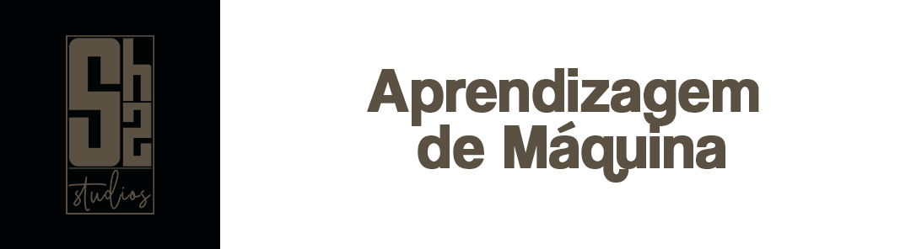

<h1>Repositorio referente as listas de exercicio da disciplina de **aprendizagem de máquina** </h1>

### Atualizações do repositorio
- [x] Lista 01_AM
- [x] Lista 02_AM
- [x] Lista 03_AM
- [x] Lista 04_AM
- [x] Lista 04b_AM
- [x] Lista 05_AM
- [x] Lista 07_AM

### Tecnologias utilizadas para implementação 
1. Python
2. PyCharm Profissional 2022.3.3

[Resolução das listas](https://drive.google.com/drive/folders/1exszd8b56_D1dJc1LhvrFNNzTbpOOIjz?usp=sharing)
